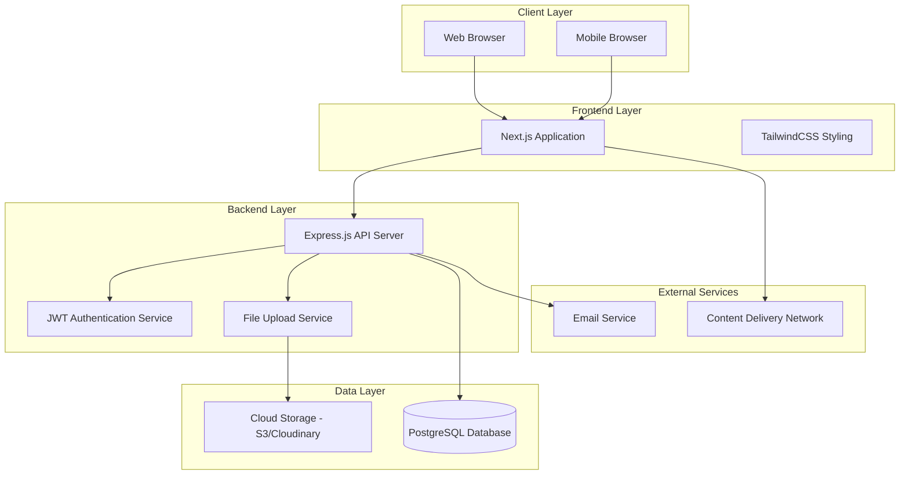
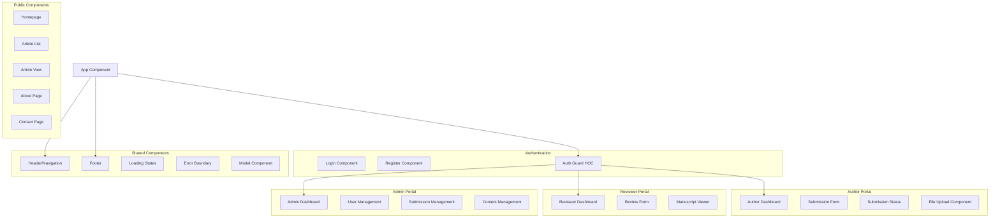
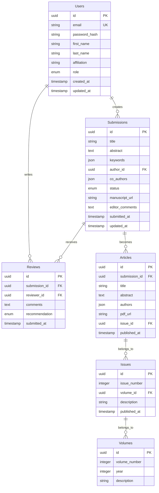

# Design Document

## Overview

The Africa Journal of Social Work and Social Policy platform is designed as a modern, scalable web application that supports the complete scholarly publishing lifecycle. The system follows a microservices-inspired architecture with clear separation between frontend presentation, backend API services, and data persistence layers. The design prioritizes security, user experience, and the specific needs of academic publishing workflows while supporting the journal's mission of promoting decolonial scholarship and Indigenous African knowledge systems.

## Architecture

### High-Level Architecture



### Technology Stack Rationale

- **Frontend**: Next.js provides server-side rendering for SEO optimization (crucial for academic discoverability), built-in routing, and excellent developer experience
- **Styling**: TailwindCSS offers utility-first styling that enables rapid, consistent UI development while maintaining design system coherence
- **Backend**: Express.js provides a mature, well-documented framework with extensive middleware ecosystem for authentication, file handling, and API development
- **Database**: PostgreSQL offers ACID compliance, complex query capabilities, and robust data integrity essential for academic publishing workflows
- **Authentication**: JWT tokens provide stateless, scalable authentication suitable for distributed deployment
- **File Storage**: Cloud storage (S3/Cloudinary) ensures reliable, scalable PDF storage with CDN capabilities

## Components and Interfaces

### Frontend Components Architecture



### Backend API Structure

```mermaid
graph TD
    subgraph "API Routes"
        AuthRoutes[/api/auth]
        UserRoutes[/api/users]
        SubmissionRoutes[/api/submissions]
        ReviewRoutes[/api/reviews]
        ArticleRoutes[/api/articles]
        AdminRoutes[/api/admin]
        FileRoutes[/api/files]
    end
    
    subgraph "Middleware"
        AuthMiddleware[Authentication Middleware]
        RoleMiddleware[Role-based Access Control]
        ValidationMiddleware[Request Validation]
        ErrorMiddleware[Error Handling]
        LoggingMiddleware[Request Logging]
    end
    
    subgraph "Services"
        AuthService[Authentication Service]
        UserService[User Management Service]
        SubmissionService[Submission Service]
        ReviewService[Review Service]
        FileService[File Management Service]
        EmailService[Email Notification Service]
    end
    
    subgraph "Data Access Layer"
        UserRepository[User Repository]
        SubmissionRepository[Submission Repository]
        ReviewRepository[Review Repository]
        ArticleRepository[Article Repository]
    end
```

### Key Interface Definitions

#### User Management Interface
```typescript
interface User {
  id: string;
  email: string;
  firstName: string;
  lastName: string;
  affiliation: string;
  role: 'author' | 'reviewer' | 'editor' | 'admin';
  createdAt: Date;
  updatedAt: Date;
}

interface AuthResponse {
  user: User;
  token: string;
  refreshToken: string;
}
```

#### Submission Management Interface
```typescript
interface Submission {
  id: string;
  title: string;
  abstract: string;
  keywords: string[];
  authorId: string;
  coAuthors: string[];
  status: 'submitted' | 'under_review' | 'revisions_required' | 'accepted' | 'rejected';
  manuscriptUrl: string;
  submissionDate: Date;
  lastModified: Date;
  reviewerIds: string[];
  editorComments?: string;
}

interface Review {
  id: string;
  submissionId: string;
  reviewerId: string;
  comments: string;
  recommendation: 'accept' | 'minor_revisions' | 'major_revisions' | 'reject';
  submittedAt: Date;
}
```

## Data Models

### Database Schema Design



### Data Validation Rules

- **Email addresses**: Must be valid format and unique across the system
- **File uploads**: PDF format only, maximum 10MB size
- **Passwords**: Minimum 8 characters, must include uppercase, lowercase, and numeric characters
- **Submission titles**: Maximum 200 characters, required field
- **Abstracts**: Maximum 500 words, required for submissions
- **Keywords**: Minimum 3, maximum 10 keywords per submission

## Error Handling

### Error Classification and Response Strategy

#### Client-Side Error Handling
- **Network Errors**: Display user-friendly messages with retry options
- **Validation Errors**: Real-time form validation with specific field-level feedback
- **Authentication Errors**: Automatic redirect to login with session restoration
- **File Upload Errors**: Progress indicators with clear error messages for size/format issues

#### Server-Side Error Handling
- **400 Bad Request**: Detailed validation error messages for form corrections
- **401 Unauthorized**: Clear authentication failure messages with login redirection
- **403 Forbidden**: Role-based access denial with appropriate messaging
- **404 Not Found**: Custom 404 pages with navigation suggestions
- **500 Internal Server Error**: Generic error messages with incident logging

#### Error Logging and Monitoring
```typescript
interface ErrorLog {
  id: string;
  level: 'error' | 'warn' | 'info';
  message: string;
  stack?: string;
  userId?: string;
  endpoint?: string;
  timestamp: Date;
  metadata?: Record<string, any>;
}
```

## Testing Strategy

### Testing Pyramid Approach

#### Unit Testing (70% of tests)
- **Frontend**: Jest + React Testing Library for component testing
- **Backend**: Jest for service layer and utility function testing
- **Database**: Repository pattern testing with test database
- **Coverage Target**: 80% code coverage for critical business logic

#### Integration Testing (20% of tests)
- **API Integration**: Supertest for endpoint testing with test database
- **Authentication Flow**: Complete login/logout/session management testing
- **File Upload**: End-to-end file handling with mock storage services
- **Email Integration**: Mock email service testing for notifications

#### End-to-End Testing (10% of tests)
- **Critical User Journeys**: Playwright for complete workflow testing
  - Author submission process
  - Reviewer assignment and review submission
  - Admin publication workflow
- **Cross-browser Testing**: Chrome, Firefox, Safari compatibility
- **Mobile Responsiveness**: Testing across device sizes

### Testing Environment Strategy
- **Development**: Local testing with Docker containers for database
- **Staging**: Production-like environment for integration testing
- **Production**: Monitoring and alerting for real-time issue detection

### Continuous Integration Pipeline
1. **Code Quality**: ESLint, Prettier, TypeScript compilation
2. **Unit Tests**: Automated test execution with coverage reporting
3. **Integration Tests**: API and database integration validation
4. **Security Scanning**: Dependency vulnerability scanning
5. **Performance Testing**: Basic load testing for critical endpoints
6. **Deployment**: Automated deployment to staging environment

This design provides a robust, scalable foundation for the Africa Journal of Social Work and Social Policy platform while maintaining focus on the specific needs of academic publishing and the journal's mission of promoting decolonial scholarship.