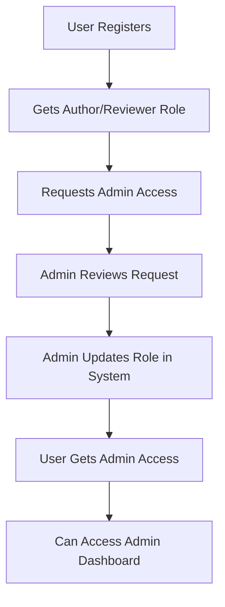

# 👑 How to Become an Admin - Complete Guide

## 🎯 **Overview: Admin Role Assignment Process**

In the Pan-African Journal manuscript management system, **becoming an admin requires role elevation** by an existing admin or through direct database modification. Here are all the methods:

## 🚀 **Method 1: Admin Role Assignment (Recommended)**

### **Prerequisites:**
- ✅ Must have an existing user account
- ✅ An existing admin must perform the role assignment
- ✅ Admin access to the system

### **Step-by-Step Process:**

#### **1. User Registration (If Not Already Registered)**
1. **Go to**: `localhost:3000/register`
2. **Fill out registration form**:
   - First Name & Last Name
   - Email Address (will be username)
   - Password (minimum 8 characters)
   - Institutional Affiliation
   - **Role**: Select "Author" or "Reviewer" (admin not available during registration)
3. **Submit registration**
4. **Account created** with initial role

#### **2. Admin Role Assignment via Dashboard**
1. **Existing admin logs in** to `localhost:3000/admin`
2. **Navigates to User Management** section
3. **Finds the user** to be promoted
4. **Updates user role** to "Admin"
5. **Saves changes**

#### **3. API-Based Role Update**
```http
PUT /api/users/{user-id}/role
Authorization: Bearer {admin-token}
Content-Type: application/json

{
  "role": "admin"
}
```

## 🔧 **Method 2: Direct Database Assignment**

### **For System Administrators:**

#### **Option A: Supabase Dashboard**
1. **Login to Supabase** dashboard
2. **Navigate to Table Editor** → `users` table
3. **Find the user** by email/ID
4. **Edit the `role` column**
5. **Change value** from current role to `admin`
6. **Save changes**

#### **Option B: SQL Command**
```sql
-- Update user role to admin
UPDATE users 
SET role = 'admin', updated_at = CURRENT_TIMESTAMP 
WHERE email = 'user@example.com';

-- Verify the change
SELECT id, email, first_name, last_name, role 
FROM users 
WHERE email = 'user@example.com';
```

## 🏗️ **Method 3: Backend Seeding/Migration**

### **For Initial System Setup:**

Create an admin user during system initialization:

```sql
-- Create initial admin user (for system setup)
INSERT INTO users (
  id,
  email,
  password_hash,
  first_name,
  last_name,
  affiliation,
  role,
  created_at,
  updated_at
) VALUES (
  uuid_generate_v4(),
  'admin@panafricanjournal.com',
  -- Password hash for a secure initial password
  '$2b$10$example_hash_here',
  'System',
  'Administrator',
  'Pan-African Journal of Social Work and Social Policy',
  'admin',
  CURRENT_TIMESTAMP,
  CURRENT_TIMESTAMP
);
```

## 🎭 **Method 4: Role Hierarchy & Promotion Path**

### **Typical Progression:**
```
Author → Reviewer → Editor → Admin
   ↓        ↓         ↓        ↓
 Basic   Review    Editorial  Full
Access   Tasks    Control   System
         Only              Access
```

### **Role Capabilities:**
- **Author**: Submit manuscripts, view own submissions
- **Reviewer**: Review assigned manuscripts + Author capabilities  
- **Editor**: Manage review process + Reviewer capabilities
- **Admin**: Full system control + All other capabilities

## 🔐 **Who Can Assign Admin Roles?**

### **Current System Permissions:**
- ✅ **Existing Admins**: Can promote any user to admin
- ✅ **System Database Admin**: Direct database access
- ❌ **Editors**: Cannot create admins (only manage reviews)
- ❌ **Authors/Reviewers**: Cannot change roles
- ❌ **Self-Registration**: Admin role not available during signup

## 📋 **Admin Role Verification**

### **How to Confirm Admin Status:**

#### **Method 1: Login Check**
1. **Login** to the system
2. **Check navigation menu** - Should show "Admin Dashboard"
3. **Access** `localhost:3000/admin` - Should work without errors

#### **Method 2: Database Verification**
```sql
SELECT email, first_name, last_name, role, created_at 
FROM users 
WHERE role = 'admin'
ORDER BY created_at;
```

#### **Method 3: API Check**
```http
GET /api/users/profile
Authorization: Bearer {user-token}
```
Response should show `"role": "admin"`

## 🚨 **Security Considerations**

### **Admin Role Security:**
- ✅ **Role validation** on all admin endpoints
- ✅ **JWT token verification** required
- ✅ **Database constraints** prevent invalid roles
- ✅ **Audit trail** tracks role changes
- ✅ **Protected routes** restrict access

### **Best Practices:**
1. **Limit admin accounts** to necessary personnel only
2. **Use strong passwords** for admin accounts
3. **Regular access review** - Remove unused admin access
4. **Monitor admin actions** through system logs
5. **Two-factor authentication** (if implemented)

## 🎯 **Quick Setup for Development/Testing**

### **Create Test Admin Account:**
1. **Register** normal account at `localhost:3000/register`
2. **Open Supabase** dashboard
3. **Go to users table** → Find your account
4. **Change role** from `author` to `admin`
5. **Login again** → Should see admin features

## 📧 **Admin Account Request Process**

### **For Production Systems:**
1. **User submits request** to existing admin
2. **Admin evaluates** user's need for admin access
3. **Admin assigns role** through dashboard/database
4. **User receives notification** of role change
5. **User can access** admin features immediately

## 🔄 **Role Management Workflow**



## ✅ **Summary: Becoming an Admin**

**The main ways to become an admin:**

1. **🏆 Most Common**: Existing admin promotes you via user management
2. **🔧 System Setup**: Database administrator assigns role directly  
3. **🎯 Initial Setup**: Created during system initialization
4. **📋 Development**: Manual database update for testing

**Key Point**: **Admin role cannot be self-assigned** - it requires existing admin privileges or direct database access for security! 🛡️

**Ready to assign admin roles?** Login to `localhost:3000/admin` with existing admin credentials and manage user roles! 🚀
